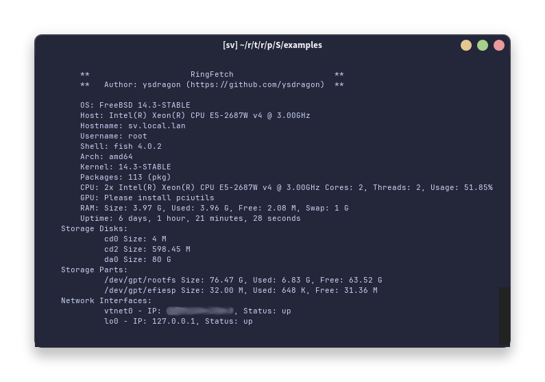

<div align="center">

# SysInfo

A comprehensive system information retrieval package for [Ring](https://ring-lang.net/) programming language

[](https://ring-lang.net/)


</div>

## Overview

SysInfo is a powerful Ring package that provides easy access to essential system information across different operating systems.

## Features

### Core System Info
- Device model
- System hostname and username
- OS name and kernel version
- CPU model, cores, and usage metrics
- RAM capacity and usage statistics
- GPU detection and details
- Storage devices and partition info
- System uptime tracking
- Virtual machine detection
- Network interface details

### Environment Details
- Shell identification and version
- Terminal emulator detection
- Package count and manager info
- System architecture detection

### Cross-Platform Support
- **Linux**, **FreeBSD**, **Windows**, and **macOS**

## Installation

### Using Ring Package Manager (`ringpm`)

#### From the RingPM Registry
```bash
# Refresh the registry first
ringpm refresh

# Install the package
ringpm install SysInfo
```

#### From This Repository
```bash
ringpm install SysInfo from ysdragon
```

To update to the latest version:
```bash
ringpm update SysInfo
```

## Usage

```ring
load "SysInfo.ring"

// Create a new SysInfo instance
sys = new SysInfo

// Get basic system information
? "OS: " + sys.os()[:name]
? "Hostname: " + sys.hostname()
? "CPU: " + sys.cpu([])[:model]
? "Total RAM: " + (sys.ram()[:size] / 1024 / 1024) + " GB"
```

For detailed API documentation, please refer to the [SysInfo Package Documentation](./docs/API.md).

## Example
Check out ***[RingFetch](https://github.com/ysdragon/SysInfo/tree/main/examples)***, a complete system information display tool built with SysInfo.

|*RingFetch on a Linux VM*                                                                                   | *RingFetch on a Windows VM*                                                                           | *RingFetch on a FreeBSD VM*                                                                           |
|-----------------------------------------------------------------------------------|----------------------------------------------------------------------------|----------------------------------------------------------------------------|
|                                        |                                 |                                 |
                                      

## Supported Operating Systems
### Fully Tested
- ** Linux**
    -  Debian
    -  Ubuntu
    -  Void Linux
    -  Alpine Linux
    -  CentOS
    -  Rocky Linux
    -  Fedora
    -  AlmaLinux
    -  Slackware Linux
    -  Kali Linux
    -  openSUSE
    -  Gentoo Linux
    -  Arch Linux
    -  Devuan Linux
    -  Chimera Linux
    -  openEuler
    -  Oracle
    -  Red Hat
    -  AOSC OS
    -  NixOS
    -  Anolis OS
- ** FreeBSD**
    - FreeBSD 14
    - FreeBSD 15
- ** Windows**
  - Windows 10
  - Windows 11
  - Windows Server 2019
  - Windows Server 2022
  - Windows Server 2025

## Contributing
Public contributions are welcome!  
You can create a [new issue](https://github.com/ysdragon/SysInfo/issues/new) for bugs, or feel free to open a [pull request](https://github.com/ysdragon/SysInfo/pulls) for any and all your changes or work-in-progress features.

## License
This project is open-source and available under the MIT License. See the [LICENSE](https://github.com/ysdragon/SysInfo/blob/main/LICENSE) file for more details.
